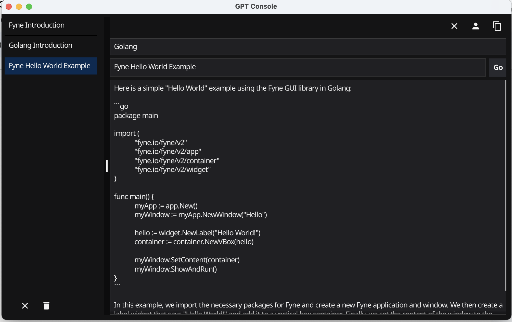

# fyne-gptconsole
Fyne GUI GPT Chat Implementation

An open source GUI application written with [Fyne](https://fyne.io/) that implements a GPT chat app is a user-friendly and intuitive tool designed to enable users to communicate seamlessly, effectively, and securely. The application leverages the power of GPT-3, a cutting-edge language model, to deliver highly effective natural language processing and better responses to users' queries. The application is built using the Go programming language and offers a robust and scalable architecture that allows it to run smoothly on different devices and platforms. Its user-friendly interface is intuitive and easy to navigate, helping users to send and receive messages, view chat history, and manage their conversations. The GPT chat app is an excellent tool for people who want to enjoy a high-quality chat experience while leveraging the power of GPT-3 natural language processing capabilities.



*By the way, the above description was generated using this tool*

## Requirements 
[OpenAI](https://platform.openai.com/docs/api-reference) API Key 

## Install and Run binaries

### MacOS 

Copy `build/gptconsole.app` to application or desired folder select and double click to run

### Windows 

ToDo

### Linux 

Todo 

## Running from source code 

1. Install [Go](https://go.dev/) 

2. Clone this repo 

3. Get required modules with the following command 

   ``` $ go mod tidy```

4. Execute the ./main.go  app with the following command 

    ```$ go run main.go```


## Creating an executable 

1. Use the following command to create an executable binary 

   ``` $ go build ```

2. Execute the binary with the following command 

   ``` $ ./gptconsole```


## Bundling app 

You can bundle the app as a platform runable binary with the following `fyne` commands 

### MacOS

   ```$ /Users/davidpitt/go/bin/fyne package -os darwin -icon logo.png```

### Windows 

   ```$ /Users/davidpitt/go/bin/fyne package -os windows -icon logo.png```

### Linux 

```$ /Users/davidpitt/go/bin/fyne package -os linux -icon logo.png```


